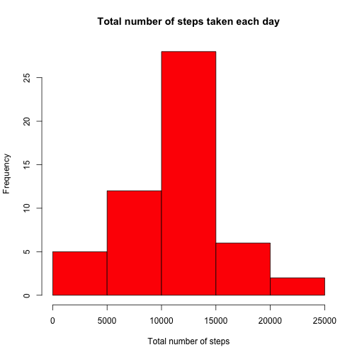
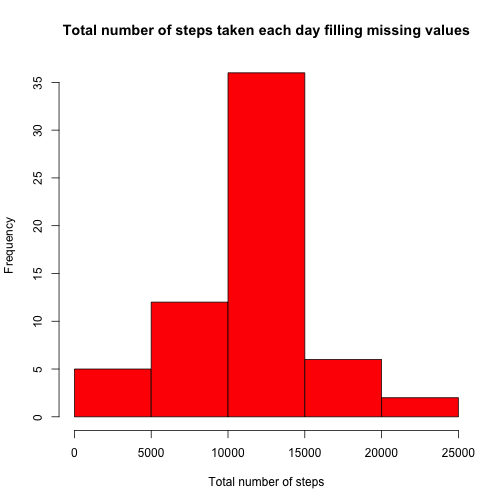
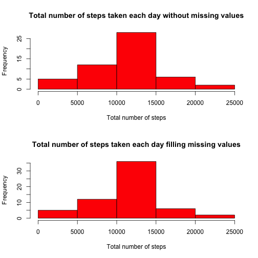

# Reproducible Research: Peer Assessment 1
by Cristina López Fernández

## Loading and preprocessing the data
First the data is read using the read.csv() function. Next, the column with the 
Date in the dataset is transform to an object of type Date instead of factor.

```r
data <- read.csv("activity.csv", na.strings="NA")
data$date <- as.Date(data$date)
```


## What is mean total number of steps taken per day?
First the missing values are ignored into the dataset.

```r
library(data.table)
```

```
## data.table 1.9.2  For help type: help("data.table")
```

```r
dataCA <- data.table(data[complete.cases(data),])
```
Now is obtained the total number of steps taken each day.

```r
tSteps <- dataCA[,sum(steps), by = date]
```
The histogram of the Total number of steps taken each day.

```r
hist(tSteps$V1, col="red", main="Total number of steps taken each day"
     , xlab="Total number of steps")
```




```r
stepsmean <- mean(tSteps$V1)
stepsmedian <-median(tSteps$V1)
```
The mean of the total number of steps taken per day is 1.0766 &times; 10<sup>4</sup> and 
the median is 10765.

## What is the average daily activity pattern?
First it is calculated the average number of steps by 5-minute interval across
all the days.

```r
avgSteps <- unique(dataCA[,ave(steps), by = interval])
```

The plot shows the average daily activity pattern.

```r
plot(avgSteps$interval, avgSteps$V1, type="l"
     , main="Average number of steps by 5-minute interval"
     , xlab="5-minute interval"
     , ylab="Avg Steps")
```


```r
maxinterval <- subset(avgSteps$interval,avgSteps$V1==max(avgSteps$V1))
```

The 835 5-minute interval contains the maximum number of steps on 
average across all the days in the dataset.

## Imputing missing values


```r
numberNAs <- length(which(!complete.cases(data)))
```

The total number of missing values in dataset is 2304.

The strategy for filling the missing values was to fill these missing
values with the average of steps for that 5-minute interval using the next code.

```r
dataToFill <- read.csv("activity.csv", na.strings="NA")
dataToFill$date <- as.Date(dataToFill$date)
for(i in 1:nrow(dataToFill)){
  if(is.na(dataToFill[i,1])){
    dataToFill[i,1] <- subset(avgSteps$V1,dataToFill[i,3]==avgSteps$interval)
  }
}
tableFilled <- data.table(dataToFill)
```
The result histogram is as follows,

```r
tStepsFilled <- tableFilled[,sum(steps), by = date]
hist(tStepsFilled$V1, col="red"
     , main="Total number of steps taken each day filling missing values"
     , xlab="Total number of steps")
```


 

```r
stepsmeanFilled <- mean(tStepsFilled$V1)
stepsmedianFilled <-median(tStepsFilled$V1)
```
The mean of the total number of steps taken per day is 1.0766 &times; 10<sup>4</sup> and 
the median is 1.0766 &times; 10<sup>4</sup> for the dataset with missing data filled in.

Next, It is shown a comparison between the both datasets. As it is shown the 
frequency increase in the center of the histogram for the dataset with missing
data filled in and the median and the mean are equals.

```r
par(mfrow=c(2,1))
hist(tSteps$V1, col="red"
     , main="Total number of steps taken each day without missing values"
     , xlab="Total number of steps")
hist(tStepsFilled$V1, col="red"
     , main="Total number of steps taken each day filling missing values"
     , xlab="Total number of steps")
```



## Are there differences in activity patterns between weekdays and weekends?

The next code is used to calculate if a date is a weekday or a weekend.

```r
dataToFill$type <- "na"
for(j in 1:nrow(dataToFill)){
  if(weekdays(dataToFill[j,2])=="sábado" || weekdays(dataToFill[j,2])=="sábado"){
    dataToFill[j,4] <- "weekend"
  }else dataToFill[j,4] <- "weekday"
}
```

Time series plot of the 5-minute interval and the average number of steps taken, 
averaged across all weekday days or weekend days.
Yes, there are differences. As it is shown in the plots people walk more in 
weekends, but later.


```r
tableWeekDay <- data.table(subset(dataToFill,dataToFill$type=="weekday"))
avgStepsWeekDay <- unique(tableWeekDay[,ave(steps), by = interval])
tableWeekEnd <- data.table(subset(dataToFill,dataToFill$type=="weekend"))
avgStepsWeekEnd <- unique(tableWeekEnd[,ave(steps), by = interval])

par(mfrow=c(2,1))
plot(avgStepsWeekDay$interval, avgStepsWeekDay$V1, type="l"
     , main="WeekDay Average number of steps by 5-minute interval"
     , xlab="5-minute interval"
     , ylab="Avg Steps")
plot(avgStepsWeekEnd$interval, avgStepsWeekEnd$V1, type="l"
     , main="WeekEnd Average number of steps by 5-minute interval"
     , xlab="5-minute interval"
     , ylab="Avg Steps")
```


